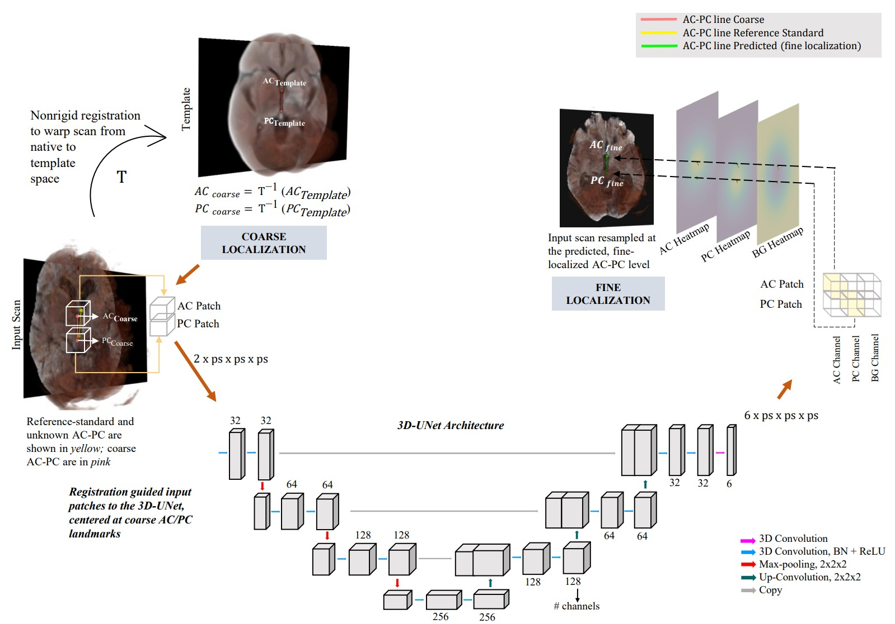

# Registration-guided 3D-UNets for AC-PC Landmark Prediction on CT
This repository provides code to develop and evaluate a framework of image registration informed 3D-UNets to automatically predict the Anterior (AC) and Posterior Commissure (PC) landmarks on non-contrast Computed Tomography (CT) scans. 

## Model Availability Disclaimer
As this framework was originally developed using data from the Dept. of Veterans Affairs (VA), we are unable to publicly release the model weights trained on internal VA head CT scans due to patient privacy regulations and data security policies. However, we provide the complete source code and a detailed step-by-step tutorial to enable researchers to train the model using their own datasets.

## Data Requirements

## System and Add-on Requirements
The coarse-localization guide for our framework was run fully within 3D Slicer using a Jupyter Notebook interface (https://github.com/Slicer/SlicerJupyter). We used 3D Slicer version 5.6.2 (https://download.slicer.org/?version=5.6.2). 

Our framework was trained with data of scale described above on a Linux machine (Ubuntu 24.04.3 LTS) with the following specifications:\
CPU: Intel(R) Core(TM) i9-10850K CPU @ 3.60GHz 20M Cache; Cores: 10 Cores / 20 Threads; Memory: 32GB

## Schematic of the Registration-guided 3D-UNet Framework

Coarse landmarks inferred via image registration (coarse localization), guide selection of image patches which are input to the 3D-UNet to perform heatmap regression around the true AC and PC landmarks, along with a background heatmap. Patch and channel specific predictions are unstacked and normalized, followed by derivation of AC-PC predictions (fine localization) as the mean location of active voxels in the regressed heatmaps. AC = Anterior Commissure, PC = Posterior-Commissure, BG = Background, ps = patch-size, BN = Batch-Normalization, ReLU = Rectified Linear Unit. Note that processing is in 3D, and 2D input slices and heatmaps are indicated for demonstration purposes. 

## Illustration of AC-PC landmark prediction on a sample CT scan 
Figure 1 shows an example of AC-PC prediction on sample CT scans of a patient with Normal Pressure Hydrocephalus (NPH) and a normal patient. N 

